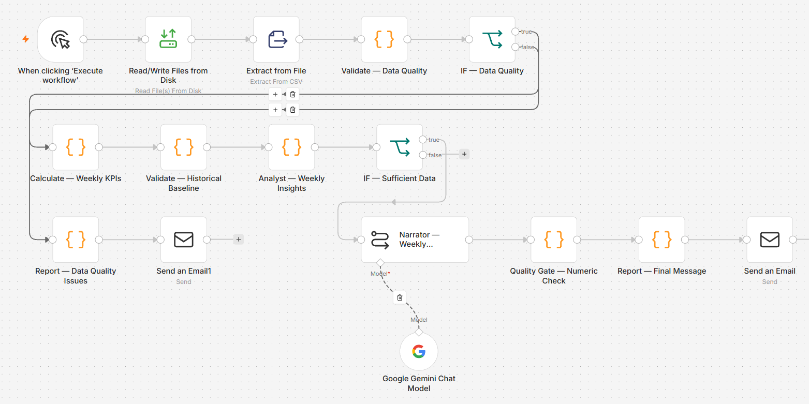
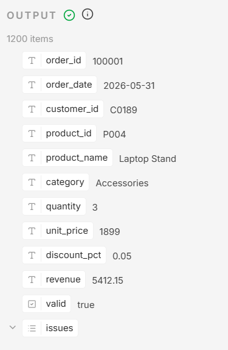
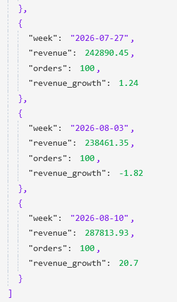
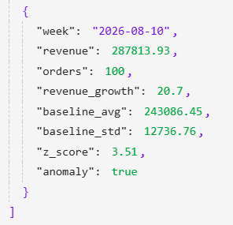
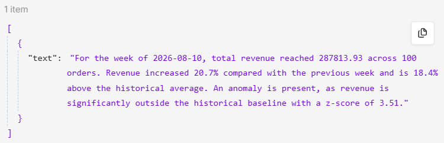
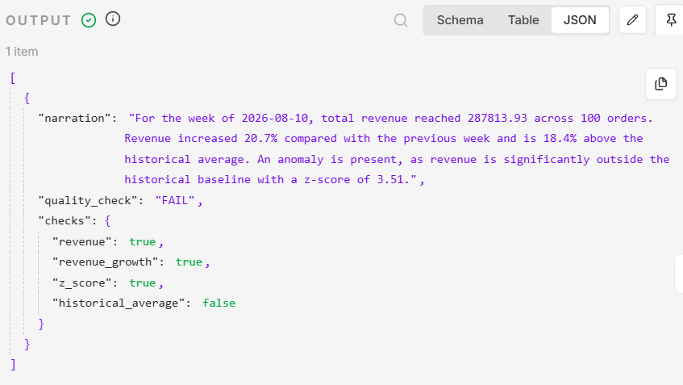
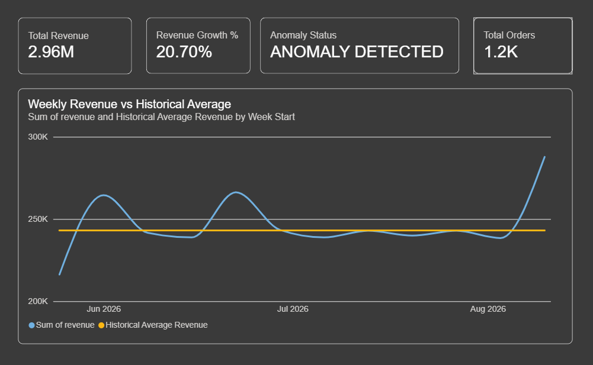

# Automated Weekly Sales Report

An n8n workflow that does the boring parts of a weekly sales report, flags numbers that look off, and emails the result. A human still decides what the numbers mean.

The data is synthetic: 1,200 made-up orders over 12 weeks, generated for this project.

## The problem

Picture an analyst on a Monday morning. Same routine every week. Pull the data, check it isn't broken, work out revenue and orders, compare with the weeks before, see if anything looks strange, write a few paragraphs for the boss, send it.

None of it is hard. It's just the same thing, every week, and that's exactly where people skip a check or mistype a number.

So I asked myself one question: which of these steps can a machine do safely, and which ones need a person?



## How it works

**1. It checks the data first.**
Before any maths, it looks for missing customer IDs, missing product IDs, bad dates, negative revenue and duplicate order IDs. If something fails, the workflow stops and sends a data-quality report instead. No point calculating KPIs on broken data.

To test this, I made a dirty file with 5 planted problems: 1 negative revenue row, 1 missing customer ID, 2 duplicate orders and 1 bad date. It caught all five.



**2. It does the weekly maths.**
Revenue, order count, week-over-week growth. For the latest week that's 287,813.93 in revenue from 100 orders, up 20.7%.



**3. It flags anything unusual.**
It compares the latest week against the average of the earlier weeks using a z-score. Latest revenue was 287,813.93. The average was 243,086.45. That gives a z-score of 3.51. My threshold is 2, so the week gets flagged as an anomaly. (The average only uses the weeks before the latest one, so the current week can't distort its own baseline.)

A flag only says "look here". It doesn't say why. Maybe a promotion, maybe one huge order, maybe a data problem. That part is for a person to find out.



**4. Gemini writes the summary.**
Once the numbers are confirmed, they go to Gemini, which turns them into a short, plain-English note for stakeholders. The numbers come from code. Gemini only does the wording.



**5. The numbers get checked again before sending.**
LLMs sometimes get numbers wrong, even when you hand them the right ones. So a plain JavaScript check compares revenue, growth, the historical average and the z-score in Gemini's text against the real values.

To test it, I told Gemini to report revenue as 999999.99. The check caught it, returned `QUALITY CHECK: FAIL`, and the report never went out. This only catches wrong numbers. It can't tell if the wording is misleading.



**6. The report lands in your inbox.**
Over SMTP, with the summary and the flagged anomaly.

<!-- ADD: screenshot of the real email here, docs/images/email-report.png -->

## What the workflow does NOT do

It never decides what to do about a spike. "Revenue is up 20.7% and outside the normal range" is something it can say. "Spend 20% more on marketing" is not. Someone has to check pricing, promotions, big customers, seasonality and data issues first.

Humans still own: why the numbers moved, what to do about it, and any change to the rules.

## How much time does it save?

I don't have a production baseline, so this is an estimate, not a measurement. Here's my guess at what a manual weekly e-commerce report takes:

| Step | Minutes |
|---|---:|
| Pull the data | 20 |
| Check data quality | 30 |
| Calculate KPIs | 30 |
| Compare with previous weeks | 20 |
| Spot unusual numbers | 15 |
| Write the summary | 30 |
| Double-check numbers and formatting | 15 |
| Send the email | 5 |
| **Total** | **165 (about 2h 45m)** |

With the workflow, the analyst only reads the report and looks into any flag. I'd say 15 minutes.

That's about **2.5 hours saved per week**, roughly **130 hours a year**, or around 16 working days. Change the numbers to match your own team and the maths still works.

## "Couldn't a template write that summary?"

Yes, for four numbers a template would do the job, and it would be simpler. I used Gemini on purpose, because I wanted to learn how to put an LLM into a business workflow without trusting it blindly. The quality gate is the real point of the project. In a bigger report, with more metrics and more context, a template stops being enough and the same gate still works.

## Tested on

Normal data, invalid dates, missing customer IDs, missing product IDs, negative revenue, duplicate orders, too little history for the baseline, a real anomaly, a wrong number from the AI, and a successful email delivery. I wanted to know it fails safely, not just that it runs.

| What went wrong | What the workflow does |
|---|---|
| Bad source data | Stops, sends a data-quality report |
| Not enough history | Skips anomaly detection |
| Unusual revenue | Flags it for a human |
| Wrong number in the AI text | Blocks the report |

## Power BI

The same data sits in a Power BI dashboard: total revenue, orders, growth, weekly revenue, historical average and anomaly status.



## Stack

n8n for orchestration, JavaScript for validation and analysis, Gemini API for the summary, Power BI for the dashboard, Docker for the local setup, SMTP for email.

## Run it yourself

1. Start n8n with Docker.
2. Import `workflow/n8n-workflow.json`.
3. Add your Gemini API key and SMTP details in the credentials.
4. Point the first node at `data/automated_reporting_sales.csv` and run it. Swap in `automated_reporting_sales_edge_cases.csv` to see the failures.

## What's missing

This is a portfolio project, not a production system. It reads from a CSV, not a database. The z-score is built on about 11 weeks, with no seasonality or trend. Next I'd connect a real database, add a human approval step for high-impact reports, and log every run.

## Files

```text
automated-sales-reporting/
├── workflow/n8n-workflow.json
├── data/
│   ├── automated_reporting_sales.csv
│   └── automated_reporting_sales_edge_cases.csv
├── powerbi/dashboard.pbix
├── docs/images/
└── README.md
```
