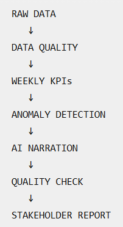

# Automated Weekly Sales Reporting & Exception Monitoring

> Turning repetitive reporting work into a controlled workflow — while keeping business decisions under human control.

## Executive Summary

Weekly sales reporting repeats the same work: collecting data, checking quality, calculating KPIs, comparing performance with historical results, identifying unusual movements, writing a summary, and distributing the report.

This project automates those repeatable steps while keeping **analysis, validation, and business decisions separated**.

The workflow processes **1,200 sales transactions across 12 weeks**, detects unusual revenue movements, generates stakeholder-friendly commentary, validates the generated numbers, and delivers the final report by email.

### Key Results

| Metric | Result |
|---|---:|
| Transactions processed | **1,200** |
| Reporting period | **12 weeks** |
| Latest weekly revenue growth | **+20.7%** |
| Latest revenue z-score | **3.51** |
| Data-quality edge cases detected | **5** |
| Incorrect AI output blocked during testing | **1** |

---

## The Business Problem

The problem is not that weekly reporting is technically difficult.

The problem is that **the same work has to be repeated every week**.

```text
Collect Data → Check Data → Calculate KPIs → Compare Performance
→ Detect Exceptions → Write Report → Send Report
```

Repeating this process creates opportunities for inconsistent calculations, missed data-quality issues, delayed reporting, repetitive analyst work, and reporting mistakes.

The goal was not to **automate everything**.

The goal was to identify **which parts should be automated, which parts should remain deterministic, and where human judgment is still necessary.**

---

## What Should Be Automated?

Good candidates are repetitive, rule-based, predictable, and easy to validate:

- Data ingestion
- Data-quality validation
- KPI calculations
- Historical comparisons
- Anomaly detection
- Report formatting
- Drafting repetitive commentary
- Numerical validation
- Report distribution

### What Should Remain Human-Led?

The system can determine:

> Revenue increased 20.7% and is outside the historical baseline.

But it should **not automatically decide**:

> Increase marketing spending by 20%.

A human may need to investigate promotions, pricing changes, large customer orders, seasonality, product launches, or data issues.

**Principle: Automate the repeatable work. Keep judgment where context is required.**

---

## How the Workflow Works


```text
Raw Sales Data
      ↓
Data Quality Validation
      ↓
Weekly KPI Calculation
      ↓
Historical Baseline
      ↓
Anomaly Detection
      ↓
AI-Generated Commentary
      ↓
Numeric Quality Check
      ↓
Email Report
```

Each stage has one primary responsibility, making it easier to identify failures and prevent bad output from moving downstream.

---

## 1. Validate the Data

Before calculating anything, the workflow checks for:

- Missing customer IDs
- Invalid dates
- Negative revenue
- Duplicate order IDs
- Missing product IDs

If validation fails, analysis does not continue. A separate data-quality report is generated instead.

### Edge-Case Test

An intentionally corrupted dataset contained:

- 1 negative revenue record
- 1 missing customer ID
- 2 duplicate order records
- 1 invalid date

The workflow detected all **5 invalid records**.


---

## 2. Calculate Weekly Performance

Validated transactions are grouped into weekly reporting periods.

The workflow calculates:

- Revenue
- Order count
- Week-over-week revenue growth
- Week-over-week order growth
- Historical average revenue

For the latest week:

| Metric | Value |
|---|---:|
| Revenue | **287,813.93** |
| Orders | **100** |
| Revenue growth | **+20.7%** |


---

## 3. Detect Unusual Performance

The latest week is compared against the historical revenue baseline.

```text
Z-score = (Current Revenue - Historical Average)
          / Historical Standard Deviation
```

For the latest week:

```text
Historical average: 243,086.45
Latest revenue:     287,813.93
Z-score:                  3.51
```

Using the project's configurable threshold of `|z| > 2`, the week is flagged as:

> **ANOMALY DETECTED**

An anomaly tells the analyst **where to look**. It does not explain why it happened.


---

## 4. Use AI for Communication — Not Truth

Once analytical results are verified, Gemini turns them into concise stakeholder-friendly commentary.

```text
Deterministic Analytics
        ↓
Verified Metrics
        ↓
Gemini
        ↓
Business Commentary
```

The LLM is **not the source of truth**. It is a communication layer.


---

## 5. Verify the AI Output

AI-generated text can contain incorrect numbers even when the underlying analysis is correct.

A deterministic quality gate checks important figures in the generated commentary:

- Revenue
- Revenue growth
- Historical average
- Z-score

During testing, I intentionally instructed the AI to report:

```text
999999.99
```

instead of the verified revenue.

The quality gate detected the mismatch:

```text
QUALITY CHECK: FAIL
```

The report was prevented from reaching the final publishing stage.

> **Don't let unverified AI output become a business report.**

*Note: this is a numerical consistency check, not a complete semantic fact-checking system.*


---

## What Happens When Something Goes Wrong?

| Situation | System Response |
|---|---|
| Invalid source data | Stop analysis and report data-quality issues |
| Insufficient historical data | Stop anomaly analysis |
| Unusual revenue movement | Flag for investigation |
| Incorrect AI numbers | Block report publication |
| Valid analysis + valid narrative | Deliver report |

**A good workflow should know when not to continue.**

---

## Who Would Use This?

**Data Analysts** — Spend less time repeating weekly reporting steps and more time investigating changes.

**Sales / Operations Managers** — Receive consistent performance and exception summaries.

**Business Leadership** — Get a concise view of what changed and where attention may be required.

**Analytics / BI Teams** — Adapt the workflow to different reporting processes while keeping validation and control points.

---

## How Much Manual Work Does It Eliminate?

I did not have a production baseline to claim a specific number of hours or percentage of time saved.

Instead, the workflow automates the repeated sequence of:

```text
Data Collection
→ Validation
→ KPI Calculation
→ Historical Comparison
→ Anomaly Detection
→ Report Drafting
→ Numerical Verification
→ Distribution
```

This removes repeated mechanical work from each reporting cycle, allowing the analyst to focus more on:

**investigating → interpreting → deciding → communicating**

---

## Human-in-the-Loop Design

| Activity | Automated? | Human Role |
|---|:---:|---|
| Load data | Yes | — |
| Validate records | Yes | Define validation rules |
| Calculate KPIs | Yes | Define metrics |
| Detect anomalies | Yes | Investigate cause |
| Draft commentary | Yes | Review when necessary |
| Verify reported numbers | Yes | — |
| Explain business cause | No | **Required** |
| Decide business action | No | **Required** |
| Change reporting logic | No | **Required** |

> **Automation should reduce repetitive work, not remove accountability.**

---

## How Could This Adapt to Another Business?

The architecture can be reused when the business problem changes.

### Marketing

```text
Campaign Data → Validate → Calculate ROAS / Conversion
→ Detect Unusual Performance → Summarize → Validate → Deliver
```

### Finance

```text
Financial Data → Validate → Calculate KPIs
→ Historical Comparison → Flag Exceptions → Report → Deliver
```

### Customer Support

```text
Ticket Data → Validate → Calculate Volume / SLA Metrics
→ Detect Spikes → Summarize → Escalate
```

The structure stays similar. The metrics, validation rules, thresholds, reporting frequency, and stakeholder requirements change.

---

## Power BI Dashboard

The same sales data is visualized in Power BI for interactive analysis.

The dashboard includes:

- Total Revenue
- Total Orders
- Revenue Growth
- Weekly Revenue
- Historical Average
- Anomaly Status


---

## Technical Architecture



```text
Sales Data
    ↓
Data Quality Checks
    ↓
Weekly KPI Analysis
    ↓
Historical Baseline + Anomaly Detection
    ↓
Gemini Narration
    ↓
Numeric Quality Gate
    ↓
Email Distribution
```

### Tools

- **n8n** — workflow orchestration
- **JavaScript** — validation and analytical logic
- **Gemini API** — stakeholder-friendly narrative generation
- **Power BI** — dashboard and visual analysis
- **Docker** — local environment
- **SMTP / Email** — report distribution

---

## Testing

The workflow was tested against both normal and failure scenarios:

- Normal dataset
- Invalid dates
- Missing customer IDs
- Negative revenue
- Duplicate order IDs
- Missing product IDs
- Insufficient historical data
- Anomaly detection
- Incorrect AI-generated numbers
- Successful email delivery

The objective was to verify not only that the workflow **works**, but also that it **fails safely**.

---

## Key Takeaway

The most important part of this project was not learning how to connect nodes in n8n.

It was learning how to think about automation as a **business process**.

I learned to:

- Identify repetitive work worth automating
- Separate deterministic analysis from AI-generated communication
- Define validation boundaries between workflow stages
- Design explicit failure paths
- Decide where human judgment is necessary
- Treat anomalies as signals for investigation
- Validate AI output before allowing it into a business-facing report
- Design workflows that can adapt to different reporting problems

> **The goal of automation is not to automate everything. It is to automate the right things, safely.**

---

## Limitations & Future Improvements

This is a portfolio implementation rather than a production reporting system.

Potential next steps:

- Connect directly to a production database instead of CSV
- Add role-based report distribution
- Improve semantic validation of AI-generated commentary
- Add historical anomaly tracking
- Add human approval for high-impact reports
- Connect additional business data sources
- Add production monitoring and execution logging

---

## Project Structure

```text
automated-sales-reporting/
│
├── workflow/
│   └── n8n-workflow.json
│
├── data/
│   ├── automated_reporting_sales.csv
│   └── automated_reporting_sales_edge_cases.csv
│
├── powerbi/
│   └── dashboard.pbix
│
├── docs/
│   └── images/
│
└── README.md
```

---

## Project Philosophy

**Don't let bad data enter the analysis.**

**Don't let unverified analysis enter the narrative.**

**Don't let unverified AI output reach the stakeholder.**

**And don't automate decisions that require human context.**